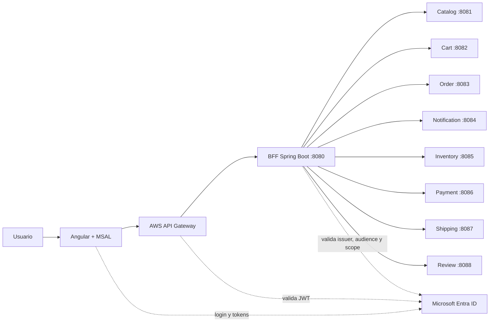

# NexoTech: contexto completo del proyecto

## 1. Resumen ejecutivo

NexoTech es una tienda de productos tecnológicos construida como una plataforma **cloud-native**. El usuario puede explorar un catálogo de celulares, computadores, televisores, consolas y accesorios; iniciar sesión con Microsoft Entra ID; administrar un carrito; cotizar despacho; autorizar un pago simulado; confirmar una compra; consultar sus pedidos; recibir notificaciones y publicar reseñas.

El proyecto fue desarrollado para la asignatura **DESY1107 - Desarrollo Cloud Native I** y está organizado alrededor de una arquitectura de microservicios construidos con Java y Spring Boot, un frontend Angular y una capa de seguridad basada en JWT.

La solución tiene cuatro capas principales:

1. **Frontend Angular:** interfaz web y experiencia de usuario.
2. **BFF Spring Boot:** punto único de entrada para Angular y coordinador de llamadas internas.
3. **Microservicios de negocio:** cada uno posee una responsabilidad delimitada.
4. **Infraestructura cloud:** Terraform prepara AWS API Gateway y su authorizer JWT; Terraform también mantiene la configuración de Microsoft Entra ID.

> Estado actual: el sistema funciona localmente con todos los servicios levantados. La autenticación Entra ID, la protección JWT y la comunicación BFF están implementadas. El despliegue real en AWS aún requiere credenciales AWS válidas y una URL pública para el backend.

---

## 2. Problema de negocio

Una tienda tradicional puede comenzar como una sola aplicación, pero a medida que crece aparecen responsabilidades diferentes:

- El catálogo cambia con una frecuencia distinta al carrito.
- El inventario debe controlar disponibilidad y reservas.
- El checkout necesita coordinar pago, stock y despacho.
- Las notificaciones no deberían estar mezcladas con la lógica de compra.
- Las reseñas son una función independiente del proceso de pago.
- Las operaciones privadas deben estar asociadas a un usuario autenticado.

NexoTech separa estas responsabilidades en servicios independientes. De esta forma, cada módulo puede evolucionar, probarse y desplegarse de manera aislada.

### Objetivo funcional

El flujo principal que se busca demostrar es:

```text
Visitar la tienda
    -> Explorar catálogo
    -> Ver detalle y reseñas
    -> Iniciar sesión con Microsoft Entra ID
    -> Agregar productos al carrito
    -> Cotizar despacho
    -> Autorizar pago simulado
    -> Confirmar compra
    -> Reservar stock
    -> Consultar pedido
    -> Recibir notificación
```

---

## 3. Arquitectura general



### Principio BFF

Angular no conoce las direcciones internas de cada microservicio. Solo conoce:

```text
http://localhost:8080/api
```

El backend principal, llamado BFF o Backend for Frontend, recibe las solicitudes del frontend y llama a los microservicios usando `RestClient`.

Esto permite:

- Ocultar topología interna.
- Centralizar CORS.
- Centralizar la validación de JWT.
- Entregar respuestas adaptadas a la interfaz.
- Evitar que Angular tenga que coordinar varios servicios.
- Cambiar las URLs internas sin cambiar el frontend.

---

## 4. Tecnologías utilizadas

### Frontend

- Angular 22.
- TypeScript.
- Componentes standalone.
- Angular Router.
- Angular HttpClient.
- RxJS.
- `@azure/msal-angular`.
- `@azure/msal-browser`.
- Node.js 24 para ejecutar Angular 22 de forma compatible.

### Backend y microservicios

- Java 17 como nivel de compilación.
- Spring Boot 4.1.1.
- Spring MVC.
- Spring Security.
- OAuth2 Resource Server.
- Nimbus JWT.
- Spring Data JPA en catálogo, carrito, pedidos y notificaciones.
- H2 en memoria para desarrollo local.
- `RestClient` para la comunicación entre servicios.

### Identidad y seguridad

- Microsoft Entra ID.
- MSAL en Angular.
- JWT Bearer tokens.
- Validación de firma mediante JWKS.
- Validación de `iss` o issuer.
- Validación de `aud` o audiencia.
- Validación del scope `access_as_user`.
- `MsalGuard` para rutas privadas.
- `MsalInterceptor` para adjuntar el token en llamadas protegidas.

### Infraestructura

- Terraform >= 1.6.
- AWS API Gateway HTTP API v2.
- JWT Authorizer de API Gateway.
- CORS configurado desde Terraform.
- Proveedor AzureAD para registrar la aplicación de Entra ID.
- Proveedor Random para generar el identificador del scope.

---

## 5. Frontend Angular

La aplicación está en `frontend/`.

### Vistas principales

- `home`: portada comercial de NexoTech y productos destacados.
- `catalogo`: listado de productos con categorías y búsqueda.
- `producto`: detalle, precio, stock, reseñas y publicación de opinión.
- `carrito`: productos seleccionados, cantidades, despacho y checkout.
- `compras`: historial de pedidos.
- `notificaciones`: avisos de compra y notificaciones del sistema.
- `perfil`: claims básicos de la cuenta autenticada.

### Rutas públicas

```text
/
/catalogo
/catalogo/:id
/auth
```

### Rutas protegidas

```text
/carrito
/compras
/notificaciones
/perfil
```

Las rutas privadas usan `MsalGuard`. Si no existe una sesión, MSAL inicia el flujo de login mediante redirección.

### Configuración MSAL

La configuración se encuentra en:

```text
frontend/src/app/auth/auth.config.ts
frontend/src/app/auth/auth.service.ts
frontend/src/environments/environment.development.ts
frontend/src/environments/environment.ts
```

La aplicación híbrida actual de este proyecto utiliza:

```text
Tenant:
72fd0b5a-8a6a-4cff-89f6-bde961f7e250

Client ID:
097bfd84-a8e3-4232-9048-718f4d648efd

Scope:
api://nexotech-student-api/access_as_user
```

No se utiliza un client secret en Angular. La aplicación SPA utiliza Authorization Code Flow con PKCE mediante MSAL.

### Interceptor

El `MsalInterceptor` protege las rutas del backend indicadas en `protectedResourceMap`:

```text
/api/cart
/api/orders
/api/notifications
/api/me
```

Cuando Angular realiza una llamada a esos recursos, MSAL intenta obtener un token y agrega:

```http
Authorization: Bearer <access_token>
```

---

## 6. BFF Spring Boot

El backend principal está en `backend/` y se ejecuta en el puerto `8080`.

### Responsabilidades

- Recibir las llamadas del frontend.
- Validar los JWT cuando está activo el perfil `azuread`.
- Reenviar el token a microservicios internos protegidos.
- Enriquecer la respuesta del carrito con información de productos.
- Coordinar pagos, despacho y checkout desde la perspectiva del frontend.
- Exponer `/api/me` para demostrar claims del token.
- Manejar CORS.
- Traducir fallas internas a respuestas HTTP adecuadas.

### Clases relevantes

```text
backend/src/main/java/com/cloudnative/backend/controller/StoreController.java
backend/src/main/java/com/cloudnative/backend/controller/ProfileController.java
backend/src/main/java/com/cloudnative/backend/client/StoreGateway.java
backend/src/main/java/com/cloudnative/backend/config/SecurityConfig.java
backend/src/main/java/com/cloudnative/backend/config/JwtDecoderConfig.java
```

### Claims demostrables

`GET /api/me` devuelve información no sensible del token:

- `sub`: identificador del usuario.
- `name`: nombre del usuario.
- `preferred_username`: usuario o correo.
- `tid`: tenant.
- `iss`: issuer.
- `aud`: audiencia.
- `scp`: scopes.
- `roles`: roles, cuando existan.

El JWT completo nunca se devuelve al cliente como respuesta del endpoint.

---

## 7. Microservicios y responsabilidades

### 7.1 Catalog Service - puerto 8081

Responsabilidad: catálogo público de NexoTech.

Funciones:

- Listar productos.
- Filtrar por categoría.
- Consultar detalle de producto.
- Mostrar precio, marca, imagen y stock base.
- Cargar productos iniciales mediante `ProductSeeder`.

Endpoints principales:

```text
GET /api/public/health
GET /api/products
GET /api/products/{id}
POST /api/products/{id}/reserve
```

La lectura del catálogo es pública. La reserva de stock requiere autenticación.

Persistencia actual: H2 en memoria mediante JPA.

### 7.2 Cart Service - puerto 8082

Responsabilidad: carrito individual por usuario.

Funciones:

- Consultar carrito.
- Agregar producto.
- Cambiar cantidad.
- Eliminar línea.
- Vaciar carrito.
- Calcular cantidad total.

Endpoints:

```text
GET /api/cart
POST /api/cart/items
PUT /api/cart/items/{productId}
DELETE /api/cart/items/{productId}
DELETE /api/cart
```

El usuario se identifica con el `sub` del JWT.

### 7.3 Order Service - puerto 8083

Responsabilidad: compras y checkout.

Funciones:

1. Consulta el carrito.
2. Consulta productos y precios.
3. Comprueba stock.
4. Reserva o descuenta inventario.
5. Calcula el total.
6. Guarda la orden.
7. Limpia el carrito.
8. Solicita una notificación de compra.

Endpoints:

```text
GET /api/orders
GET /api/orders/{id}
POST /api/orders
```

### 7.4 Notification Service - puerto 8084

Responsabilidad: notificaciones por usuario.

Funciones:

- Listar notificaciones.
- Contar no leídas.
- Crear notificaciones internas.
- Marcar como leída.

Endpoints:

```text
GET /api/notifications
GET /api/notifications/unread-count
POST /api/notifications
PATCH /api/notifications/{id}/read
```

### 7.5 Inventory Service - puerto 8085

Responsabilidad: disponibilidad independiente del catálogo.

Funciones:

- Consultar disponibilidad de un producto.
- Reservar unidades para una operación autenticada.
- Rechazar reservas si no existe stock suficiente.

Endpoints:

```text
GET /api/public/health
GET /api/inventory/{productId}
POST /api/inventory/{productId}/reserve
```

El servicio utiliza un inventario inicial en memoria para demostración. El siguiente paso es moverlo a una base persistente.

### 7.6 Payment Service - puerto 8086

Responsabilidad: representar el proceso de autorización de pago.

Funciones:

- Crear una intención de pago.
- Devolver identificador de pago.
- Simular estado `AUTHORIZED`.
- Registrar monto, método y fecha.

Endpoints:

```text
GET /api/public/health
POST /api/payments/intent
```

Actualmente es un simulador académico. No procesa tarjetas reales ni almacena información financiera.

### 7.7 Shipping Service - puerto 8087

Responsabilidad: despacho y entrega.

Funciones:

- Cotizar un envío según región y comuna.
- Devolver promesa de entrega.
- Consultar un tracking.

Endpoints:

```text
GET /api/public/health
POST /api/shipping/quote
GET /api/shipping/{trackingId}
```

### 7.8 Review Service - puerto 8088

Responsabilidad: opiniones de productos.

Funciones:

- Listar reseñas públicamente.
- Crear reseñas para usuarios autenticados.
- Asociar la reseña a un producto.
- Registrar autor, rating, comentario y fecha.

Endpoints:

```text
GET /api/public/health
GET /api/reviews/{productId}
POST /api/reviews/{productId}
```

La lectura es pública; publicar requiere el scope `access_as_user`.

---

## 8. Seguridad por capas

### Capa Angular

- Las rutas privadas tienen `MsalGuard`.
- Las llamadas privadas pasan por `MsalInterceptor`.
- El token se solicita para el scope de la API.
- El usuario puede iniciar y cerrar sesión.

### Capa API Gateway

Terraform define:

- Authorizer JWT.
- Issuer de Entra ID.
- Audiencia esperada.
- Header `Authorization` como fuente de identidad.
- Rutas públicas explícitas.
- Ruta protegida para cualquier operación no pública.
- CORS restringido al frontend configurado.

Rutas públicas del Gateway:

```text
GET /api/public/health
GET /api/public/products
GET /api/public/products/{id}
OPTIONS /{proxy+}
```

### Capa BFF

Spring Security valida:

- Firma criptográfica.
- Issuer.
- Audiencia.
- Vigencia temporal.
- Scope `access_as_user`.

### Capa microservicios

Cada servicio tiene su propio Resource Server. Esto aplica defensa en profundidad: aunque una llamada llegue directamente a un puerto interno, el servicio vuelve a validar el token.

---

## 9. Infraestructura Terraform

La carpeta `terraform/` contiene:

```text
providers.tf
variables.tf
main.tf
outputs.tf
entra.tf
backend.tf
terraform.tfvars.example
```

### Recursos AWS

- AWS API Gateway HTTP v2.
- JWT Authorizer.
- Integración HTTP proxy hacia el backend.
- Rutas públicas específicas.
- Ruta protegida para el resto.
- Stage `dev`.
- Configuración CORS.

### Recursos Microsoft Entra

Terraform mantiene una configuración para:

- Registrar la aplicación del proyecto.
- Exponer el scope `access_as_user`.
- Configurar la plataforma SPA.
- Registrar redirect URI y logout URI.
- Entregar outputs de client ID, tenant y scope.

La cuenta Azure for Students no tiene permisos administrativos completos de Microsoft Graph. Por eso la solución usa una aplicación híbrida `NexoTech Student` y evita depender de operaciones administrativas como crear service principals o conceder consentimiento organizacional automáticamente.

### Comandos Terraform

```bash
cd terraform
terraform init -upgrade
terraform fmt -recursive
terraform validate
terraform plan
terraform apply
```

El despliegue AWS todavía necesita:

- Credenciales AWS válidas.
- URL pública del backend.
- Origen real del frontend.
- Audience final de la API.

---

## 10. Cómo ejecutar localmente

### 10.1 Requisitos

- Node.js 24 recomendado para Angular 22.
- npm.
- Java 17 o compatible.
- Maven.
- Terraform.
- Azure CLI si se desea administrar Entra mediante Terraform.

### 10.2 Variables Azure AD

```bash
export SPRING_PROFILES_ACTIVE=azuread
export AZURE_TENANT_ID="72fd0b5a-8a6a-4cff-89f6-bde961f7e250"
export AZURE_API_AUDIENCE="097bfd84-a8e3-4232-9048-718f4d648efd"
```

### 10.3 Levantar servicios

Cada servicio debe ejecutarse en una terminal separada:

```bash
cd services/catalog-service && mvn spring-boot:run
cd services/cart-service && mvn spring-boot:run
cd services/order-service && mvn spring-boot:run
cd services/notification-service && mvn spring-boot:run
cd services/inventory-service && mvn spring-boot:run
cd services/payment-service && mvn spring-boot:run
cd services/shipping-service && mvn spring-boot:run
cd services/review-service && mvn spring-boot:run
```

Backend:

```bash
cd backend
sh ./mvnw spring-boot:run
```

Frontend:

```bash
cd frontend
PATH="$(brew --prefix node@24)/bin:$PATH" npm start
```

Aplicación:

```text
http://localhost:4200
```

---

## 11. Pruebas rápidas

Health del BFF:

```bash
curl http://localhost:8080/api/public/health
```

Catálogo público:

```bash
curl http://localhost:8080/api/public/products
```

Reseñas públicas:

```bash
curl http://localhost:8080/api/public/products/1/reviews
```

Endpoint privado sin token, debe responder `401`:

```bash
curl -i http://localhost:8080/api/me
curl -i http://localhost:8080/api/cart
```

Pago sin token, debe responder `401`:

```bash
curl -i -X POST http://localhost:8080/api/payments/intent \
  -H "Content-Type: application/json" \
  -d '{"amount":1000,"method":"SIMULATED_CARD"}'
```

Validaciones realizadas durante el desarrollo:

- Backend BFF: tests Maven correctos.
- Catálogo: tests Maven correctos.
- Nuevos servicios: compilación Maven correcta.
- Frontend: `npm run build` correcto con Node 24.
- Terraform: `terraform validate` correcto.
- Health de los nuevos servicios: `200`.
- Rutas privadas sin token: `401`.

---

## 12. Estado actual y limitaciones

### Implementado

- Arquitectura de microservicios.
- Frontend funcional.
- Catálogo tecnológico.
- Carrito por usuario.
- Checkout.
- Inventario.
- Pago simulado.
- Cotización de despacho.
- Reseñas.
- Notificaciones.
- MSAL y Entra ID.
- Validación JWT en BFF y microservicios.
- Terraform para API Gateway y Entra.

### Limitaciones actuales

1. Las bases principales usan H2 en memoria y pierden datos al reiniciar.
2. Inventario y reseñas usan estructuras en memoria.
3. El pago es simulado y no utiliza un proveedor real.
4. El despacho es simulado y no conecta con un operador logístico.
5. No existe todavía un servicio de configuración centralizada.
6. No existe observabilidad centralizada con logs, métricas y trazas.
7. AWS API Gateway está definido, pero no aplicado debido a credenciales AWS pendientes.
8. El backend todavía necesita una URL pública para ser integrado desde API Gateway.
9. Solo algunos servicios tienen Dockerfile; se recomienda agregar uno por servicio.
10. El checkout coordina varios servicios sin una saga o mecanismo de compensación completo.

---

## 13. Próximos pasos priorizados

### Prioridad 1: terminar la demostración local

1. Configurar la aplicación `NexoTech Student` en Entra con la redirect URI exacta:
   `http://localhost:4200/auth`.
2. Iniciar sesión desde Angular.
3. Verificar que el access token contenga:
   `api://nexotech-student-api/access_as_user`.
4. Probar carrito, checkout, reseñas y notificaciones con una sesión real.
5. Confirmar `/api/me` y mostrar sus claims durante la presentación.

### Prioridad 2: completar pruebas automatizadas

1. Agregar tests de seguridad para validar:
   - Sin token: `401`.
   - Audiencia incorrecta: `401`.
   - Scope ausente: `403`.
   - Token válido: acceso permitido.
2. Agregar tests de controllers para los cuatro servicios nuevos.
3. Agregar una prueba de integración del checkout completo.
4. Agregar una prueba Angular para MSAL Guard e interceptor.

### Prioridad 3: persistencia

1. Reemplazar H2 por PostgreSQL o Azure Database for PostgreSQL.
2. Separar una base por microservicio o esquema por bounded context.
3. Incorporar migraciones con Flyway o Liquibase.
4. Crear índices para usuario, producto, orden y fecha.
5. Mantener secretos fuera del repositorio usando variables de entorno o Key Vault.

### Prioridad 4: despliegue cloud

1. Renovar/configurar credenciales AWS válidas.
2. Publicar backend en EC2, ECS o App Runner.
3. Publicar frontend en S3 + CloudFront o equivalente.
4. Completar `url_backend` en `terraform.tfvars`.
5. Configurar dominio HTTPS.
6. Agregar el dominio productivo como redirect URI en Entra.
7. Ejecutar `terraform plan` y revisar que solo existan cambios esperados.
8. Ejecutar `terraform apply`.
9. Actualizar `environment.ts` con la URL real del API Gateway.

### Prioridad 5: operación y calidad

1. Crear Dockerfile para cada microservicio.
2. Crear `docker-compose.yml` para desarrollo.
3. Agregar GitHub Actions para build, tests y análisis.
4. Incorporar Actuator y health checks.
5. Centralizar logs.
6. Agregar métricas y trazas distribuidas.
7. Configurar límites de rate y alarmas en API Gateway.
8. Implementar retry, timeout y circuit breaker para llamadas internas.
9. Diseñar una saga para checkout con compensación de reservas.

### Prioridad 6: mejorar la experiencia de usuario

1. Agregar estados de carga y skeletons.
2. Agregar recuperación visual ante errores de sesión o token.
3. Permitir seleccionar método de despacho.
4. Mostrar seguimiento de pedidos.
5. Incorporar filtros por precio, marca y disponibilidad.
6. Agregar favoritos o lista de deseos.
7. Agregar perfil editable y dirección guardada.
8. Reemplazar el pago simulado por un sandbox real.

---

## 14. Relación con la rúbrica

### Indicador frontend: MSAL y Angular

La solución cuenta con:

- Librerías MSAL configuradas.
- Login redirect.
- Logout redirect.
- `MsalGuard`.
- `MsalInterceptor`.
- Tokens para el API.
- Scope `access_as_user`.
- Lectura de claims en el perfil.
- Rutas públicas y privadas separadas.

### Indicador backend y BFF

La solución cuenta con:

- Resource Server Spring Security.
- Validación de issuer.
- Validación de audiencia.
- Validación de firma.
- Validación de expiración.
- Validación de scope.
- Códigos `401` y `403` para accesos no autorizados.
- API Gateway con authorizer JWT preparado.
- Rutas públicas explícitas.
- Microservicios que vuelven a validar el token.

Para demostrarlo en la presentación se recomienda mostrar:

1. Catálogo accesible sin sesión.
2. Carrito bloqueado sin sesión.
3. Login Microsoft Entra.
4. Token solicitado para el scope propio.
5. Carrito accesible después del login.
6. `/api/me` mostrando `aud`, `iss`, `scp` y `roles`.
7. Checkout con despacho, pago simulado, orden y notificación.
8. Reseña pública y publicación autenticada.

---

## 15. Estructura resumida del repositorio

```text
backend/                         BFF Spring Boot :8080
frontend/                        SPA Angular :4200
services/catalog-service/        Catálogo :8081
services/cart-service/           Carrito :8082
services/order-service/          Órdenes :8083
services/notification-service/  Notificaciones :8084
services/inventory-service/      Inventario :8085
services/payment-service/        Pagos :8086
services/shipping-service/       Despacho :8087
services/review-service/         Reseñas :8088
terraform/                       AWS Gateway + Entra ID
README.md                        Guía breve del proyecto
CONTEXTO.md                      Contexto táctico original
MICROSOFT_ENTRA_CONFIG.md        Configuración de identidad
```

---

## 16. Conclusión

NexoTech pasó de ser una maqueta inicial a una plataforma demostrable de comercio tecnológico. Su principal valor académico está en mostrar cómo Angular, MSAL, un BFF Spring Boot, varios microservicios y un API Gateway pueden trabajar juntos bajo una política de seguridad basada en JWT.

La siguiente etapa no debería consistir en agregar más pantallas aisladas, sino en consolidar persistencia, pruebas, despliegue cloud, observabilidad y manejo de fallas distribuidas. Con esas mejoras, el proyecto quedaría preparado para una demostración más cercana a un escenario productivo.
